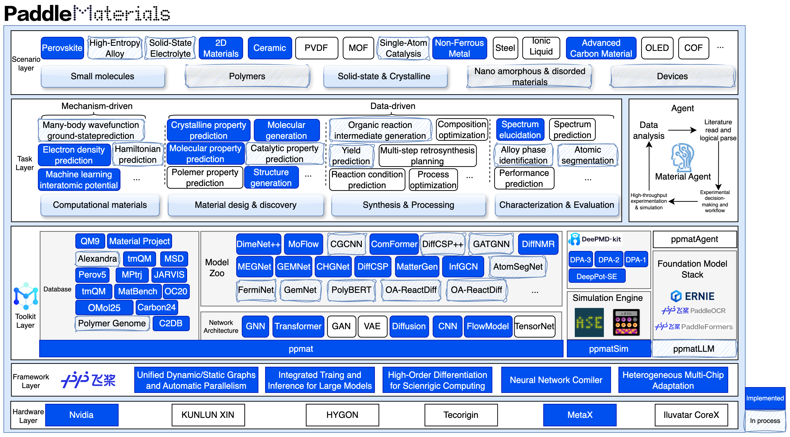
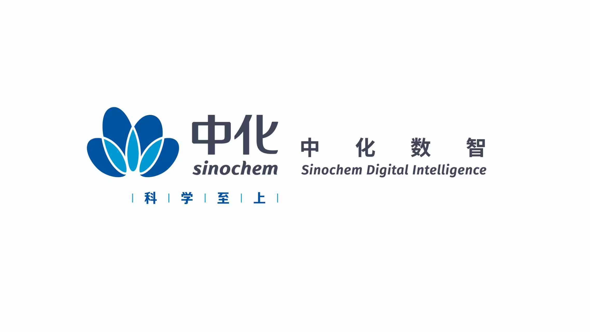

# PaddleMaterials

<p align="center">
  <a href="README.md"></a>
  <a href="README_zh.md"></a>
  <a href="README_ja.md"></a>
</p>

<p align="center"></p>

<p align="center">
  <a href="Install.md"></a>
  <a href="https://pypi.org/project/ppmat/"></a>
  <a href="LICENSE"></a>
  <a href="https://github.com/PaddlePaddle/PaddleMaterials/stargazers"></a>
</p>

## 🚀 简介

**PaddleMaterials** 是一款基于 **PaddlePaddle** 深度学习框架构建的端到端 AI4Materials 工具包。作为面向材料科学基础模型开发与部署的数据—机理双驱动平台，**PPMat** 帮助研究人员高效构建 AI 模型，并利用预训练模型加速材料发现。

<p align="left"></p>

### 🧩 核心能力

| 任务 | 描述 | 典型应用 |
|------|------|----------|
| **性质预测（PP）** | 根据材料结构预测性质 | 正向设计，或预测形成能、带隙、弹性模量等 |
| **结构生成（SG）** | 生成新型晶体结构 | 逆向设计或结构生成 |
| **机器学习原子间势（MLIP）** | 用机器学习势作为 DFT 的代理模型 | 分子动力学模拟 |
| **电子结构（ES）** | 用代理模型替代 DFT 预测物理场 | 电子密度预测 |
| **谱图解析（SE）** | 根据谱图重建结构 | NMR 结构解析 |
| **谱图增强（SPEN）** | 增强显微图像与谱图信号 | STEM 图像增强、去噪 |

### 🧱 支持的材料体系

- **无机晶体** — 支持完善，提供多个数据集和预训练模型
- **有机分子** — 支持小分子和部分聚合物等多个数据集及预训练模型

### ✨ 为什么选择 PaddleMaterials？

- ✅ **丰富的预训练模型与 AI-ready 数据集** — 提供 50+ 个可直接推理的预训练模型，以及多个用于训练的精选数据集
- ✅ **多任务集成** — 使用统一框架支持 PP、SG、MLIP、ES、SE、SPEN 等任务
- ✅ **多硬件支持** — 全面支持 NVIDIA GPU、MetaX GPU 和 Intel CPU
- ✅ **生产就绪** — 标准化设计，易于使用，并支持分布式训练、混合精度和断点恢复

### 📑 支持的任务

| 任务 | 描述 | 链接 |
|------|------|------|
| **性质预测（PP）** | 预测形成能、带隙和弹性性质 | [README](property_prediction/README.md) |
| **结构生成（SG）** | 使用扩散模型生成新的晶体结构 | [README](structure_generation/README.md) |
| **机器学习原子间势（MLIP）** | 用于分子动力学、具有 DFT 精度的势函数 | [README](interatomic_potentials/README.md) |
| **电子结构（ES）** | 预测电子结构性质 | [README](electronic_structure/README.md) |
| **谱图解析（SE）** | 根据 NMR 谱图重建分子结构 | [README](spectrum_elucidation/README.md) |
| **谱图增强（SPEN）** | 增强显微图像和谱图信号 | [README](spectrum_enhancement/README.md) |

### 🤖 可用的预训练模型

| 任务 | 模型 | 数据集 |
|------|------|--------|
| **性质预测** | MEGNet、iComformer、DimeNet++、SphereNet | MP2018、MP2024、JARVIS、QM9 等 |
| **结构生成** | MatterGen、DiffCSP | MP20、ALEX 等 |
| **机器学习原子间势** | CHGNet、MatterSim、SphereNet | MPTRJ、MD17 等 |
| **电子结构** | InfGCN | QM9_ES、MP_ES、OMol25_MC_ES 等 |
| **谱图解析** | DiffNMR | MSD_NMR 等 |
| **谱图增强** | SFIN | SFIN-HAADF/BF 等 |

完整模型列表：参见 [MODEL_REGISTRY](ppmat/models/__init__.py#L75)。

---

## 🚀 快速开始

### 🔧 安装

请根据您的硬件环境参阅[安装文档](Install.md)。有关多硬件适配的更多信息，请参阅[支持的硬件列表](./docs/multi_device.md)。

---

### ⚡ 快速推理

#### 性质预测

使用预训练 MEGNet 模型预测材料形成能：

```bash
python property_prediction/predict.py \
    --model_name='megnet_mp2018_train_60k_e_form' \
    --weights_name='best.pdparams' \
    --cif_file_path='./property_prediction/example_data/cifs/' \
    --save_path='result.csv'
```

#### 结构生成

使用预训练 MatterGen 模型生成新的晶体结构：

```bash
python structure_generation/sample.py \
    --model_name='mattergen_mp20' \
    --weights_name='latest.pdparams' \
    --output_dir='result_mattergen_mp20/' \
    --mode='by_num_atoms' \
    --num_atoms=4
```

#### 原子间势

使用预训练 MatterSim 模型预测能量和力：

```bash
python interatomic_potentials/predict.py \
    --model_name='mattersim_1M' \
    --weights_name='mattersim-v1.0.0-1M_model.pdparams' \
    --cif_file_path='./interatomic_potentials/example_data/cifs/' \
    --save_path='result.csv'
```

#### 电子结构

使用预训练 InfGCN 模型对仓库自带的甲烷示例预测电子密度：

```bash
python electronic_structure/predict.py \
    --model_name='infgcn_qm9' \
    --weights_name='best.pdparams' \
    --mol_file_path='electronic_structure/configs/infgcn/example/methane.mol' \
    --grid_shape=8 \
    --grid_batch_size=4096 \
    --save_path='output/infgcn_qm9/methane'
```

有关基于数据集或本地检查点推理的方法，请参阅
[InfGCN 预测指南](electronic_structure/configs/infgcn/README.md#prediction)。

#### 谱图解析

使用预训练 DiffNMR 模型和仓库自带示例运行 NMR 谱图解析：

```bash
python spectrum_elucidation/sample.py \
    --model_name='diffnmr_msdnmr_nless15' \
    --weights_name='best.pdparams' \
    --output_dir='result_diffnmr_nless15/'
```

#### 谱图增强

使用预训练 SFIN 模型增强 STEM 图像：

```bash
python spectrum_enhancement/predict.py \
    --model_name='sfin_haadf_enhance' \
    --weights_name='best.pdparams' \
    --input_path='path/to/noisy_image.png' \
    --output_dir='result_sfin/'
```

---

### 🏋️ 开始训练

有关训练和微调的方法，请参阅[相关文档](get_started.md)。

---

## 🤝 贡献者、合作伙伴与社区

[](https://www.star-history.com/#PaddlePaddle/PaddleMaterials&type=date&legend=top-left)

感谢所有为 PaddleMaterials 建设作出贡献的开发者！

<a href="https://github.com/PaddlePaddle/PaddleMaterials/graphs/contributors"></a>

感谢以下组织提供合作支持！

<p align="left">
  
  
  
</p>

欢迎加入 PaddleMaterials 微信群与我们交流！

<p align="left"></p>

## 🛠️ 参与 PaddleMaterials

开发者请参阅[架构文档](docs/ARCHITECTURE_ch.md)。

---

## 📜 许可证

PaddleMaterials 基于 [Apache License 2.0](LICENSE) 许可。

---

## 🎓 引用

```bibtex
@misc{paddlematerials2025,
  title={PaddleMaterials, a deep learning toolkit based on PaddlePaddle for material science.},
  author={PaddleMaterials Contributors},
  howpublished = {\url{https://github.com/PaddlePaddle/PaddleMaterials}},
  year={2025}
}
```

---

## 🙏 致谢

本仓库参考了以下项目的代码：

[PaddleScience](https://github.com/PaddlePaddle/PaddleScience) |
[Matgl](https://github.com/materialsvirtuallab/matgl) |
[CDVAE](https://github.com/txie-93/cdvae) |
[DiffCSP](https://github.com/jiaor17/DiffCSP) |
[MatterGen](https://github.com/microsoft/mattergen) |
[MatterSim](https://github.com/microsoft/mattersim) |
[CHGNet](https://github.com/CederGroupHub/chgnet) |
[AIRS](https://github.com/divelab/AIRS)
