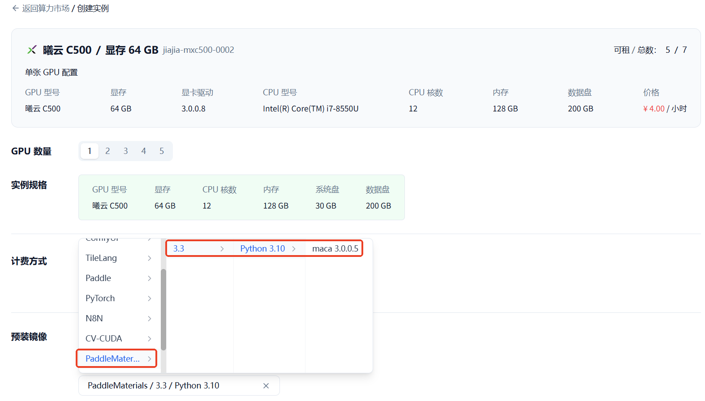
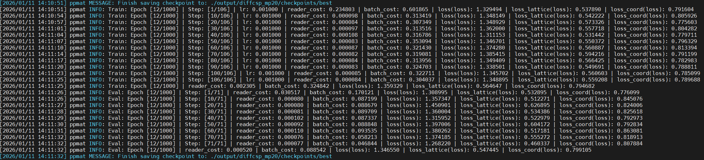
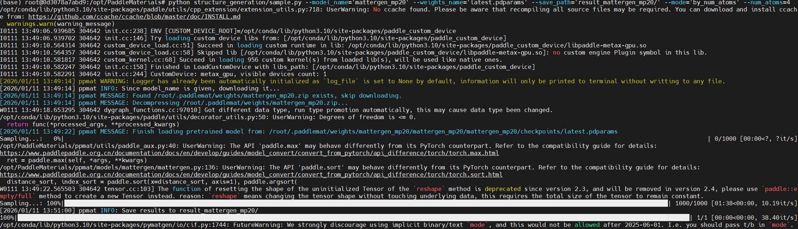
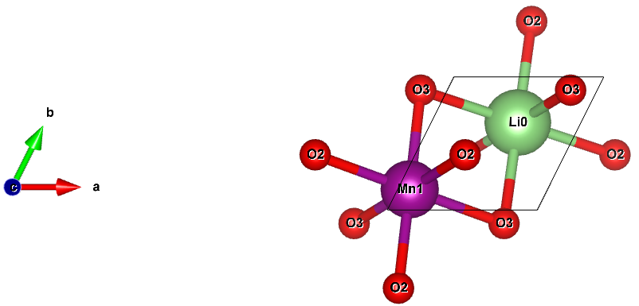

# PaddleMaterials on GiteeAI (MetaX)

## Environment Setup on GiteeAI
1. Register and log in to [giteeAI](https://ai.gitee.com/).
2. Purchase computing resources and click **Rent Now**.  
   
3. Choose the **PaddleMaterials** image and click **Next** to create an instance.  
   
4. After the instance is created, click **Lab** to enter the container.  
   
5. In the Lab page, choose **Jupyter Lab**, then open a **Terminal**.  
   

## Training Process
PaddleMaterials source directory: `/opt/PaddleMaterials`
Reference documents:
- [MLIP - Machine Learning Interatomic Potential](https://github.com/PaddlePaddle/PaddleMaterials/blob/develop/interatomic_potentials/README.md)
- [MLES - Machine Learning Electronic Structure](https://github.com/PaddlePaddle/PaddleMaterials/blob/develop/electronic_structure/README.md)
- [PP - Property Prediction](https://github.com/PaddlePaddle/PaddleMaterials/blob/develop/property_prediction/README.md)
- [SG - Structure Generation](https://github.com/PaddlePaddle/PaddleMaterials/blob/develop/structure_generation/README.md)
- [SE - Spectrum Elucidation](https://github.com/PaddlePaddle/PaddleMaterials/blob/develop/spectrum_elucidation/README.md)

Below is the **Structure Generation / DiffCSP** example.

### 1) Train
```bash
# single-gpu training
python structure_generation/train.py -c structure_generation/configs/diffcsp/diffcsp_mp20.yaml
```


### 2) Sample
```bash
python structure_generation/sample.py --model_name='diffcsp_mp20' --weights_name='latest.pdparams' --output_dir='result_diffcsp_mp20-1/' --chemical_formula='LiMnO2'
```


Result example: `Li1-Mn1-O2_1.cif`  


---

## MetaX Results (from the "PaddleMaterials on MetaX benchmark" sheet)

### Machine Learning Interatomic Potentials (MLIP)
| Model | Metric | Benchmark | MetaX | Difference | Notes |
| --- | --- | --- | --- | --- | --- |
| CHGNet | energy_per_atom | -7.367691 | -7.3676915 | 5.0e-07 | |
| CHGNet | force (max abs diff) | - | - | 3.03e-06 | Max component diff across 8 samples; see sheet for per-axis values |
| CHGNet | magmom (max abs diff) | - | - | 7.0e-07 | Max across 8 samples; see sheet for per-axis values |
| MatterSim | energy | -6.6172876 | -6.6172876 | 0 | |
| MatterSim | force (max abs diff) | - | - | 1.64e-06 | Max component diff across 8 samples; see sheet for per-axis values |

**CHGNet - force details**
| # | Benchmark (x, y, z) | MetaX (x, y, z) | Difference (x, y, z) |
| --- | --- | --- | --- |
| 1 | -2.98e-08, -1.13e-07, 2.38e-02 | 1.19e-07, -7.66e-08, 2.38e-02 | 1.49e-07, 3.62052e-08, 8.214e-07 |
| 2 | 2.98e-08, -1.41e-07, -2.38e-02 | -4.47e-08, 7.60e-08, -2.38e-02 | 7.45058e-08, 2.16824e-07, 5.809e-07 |
| 3 | 3.58e-07, 1.12e-07, 9.26e-02 | 1.49e-07, 4.66e-08, 9.26e-02 | 2.08616e-07, 6.51926e-08, 3.879e-07 |
| 4 | -2.98e-08, 4.10e-08, -9.26e-02 | 1.49e-07, -1.49e-08, -9.26e-02 | 1.78814e-07, 5.58794e-08, 3.75e-08 |
| 5 | 8.94e-08, 1.46e-07, -2.43e-03 | 2.98e-08, 6.89e-08, -2.43e-03 | 5.96046e-08, 7.68341e-08, 2.3842e-07 |
| 6 | -2.09e-07, -1.97e-06, -1.31e-02 | -7.45e-07, 1.06e-06, -1.31e-02 | 5.36442e-07, 3.0254e-06, 1.5495e-06 |
| 7 | 2.98e-08, 1.89e-06, 1.31e-02 | 6.26e-07, -1.03e-06, 1.31e-02 | 5.96046e-07, 2.91504e-06, 1.0731e-06 |
| 8 | -1.19e-07, 7.73e-08, 2.43e-03 | -5.96e-08, -6.19e-08, 2.43e-03 | 5.96046e-08, 1.39233e-07, 1.22192e-06 |

**CHGNet - magmom details**
| # | Benchmark | MetaX | Difference |
| --- | --- | --- | --- |
| 1 | 3.04922e-03 | 3.05e-03 | 6.71e-08 |
| 2 | 3.04934e-03 | 3.05e-03 | 1.043e-07 |
| 3 | 3.86942e+00 | 3.87e+00 | 7e-07 |
| 4 | 3.86942e+00 | 3.87e+00 | 7e-07 |
| 5 | 4.41358e-02 | 4.41e-02 | 1.64e-07 |
| 6 | 3.86221e-02 | 3.86e-02 | 0 |
| 7 | 3.86220e-02 | 3.86e-02 | 1.26e-07 |
| 8 | 4.41357e-02 | 4.41e-02 | 7.4e-08 |

**MatterSim - force details**
| # | Benchmark (x, y, z) | MetaX (x, y, z) | Difference (x, y, z) |
| --- | --- | --- | --- |
| 1 | 1.72e-07, -9.79e-08, 1.26e-01 | 7.28e-08, 3.45e-08, 1.26e-01 | 9.8953e-08, 1.32313e-07, 9e-08 |
| 2 | 7.01e-08, 5.59e-09, -1.26e-01 | -1.08e-07, 8.89e-08, -1.26e-01 | 1.77938e-07, 8.3357e-08, 7.4e-07 |
| 3 | -8.96e-09, -1.93e-07, -1.51e-01 | -1.87e-08, -6.15e-07, -1.51e-01 | 9.77889e-09, 4.22704e-07, 3.1e-07 |
| 4 | -2.14e-07, -1.66e-07, 1.51e-01 | -1.33e-07, 2.61e-07, 1.51e-01 | 8.07632e-08, 4.26546e-07, 1.01e-06 |
| 5 | 1.65e-07, 2.76e-07, -1.01e-01 | -5.97e-08, 3.58e-07, -1.01e-01 | 2.25031e-07, 8.19564e-08, 1.4e-06 |
| 6 | -1.81e-07, 2.43e-07, 8.90e-02 | -3.03e-07, -9.78e-08, 8.90e-02 | 1.21773e-07, 3.41037e-07, 3.57e-07 |
| 7 | -1.89e-07, 4.66e-08, -8.90e-02 | 5.16e-07, 1.99e-07, -8.90e-02 | 7.04895e-07, 1.52737e-07, 5.66e-07 |
| 8 | -1.68e-07, -1.27e-07, 1.01e-01 | -3.02e-08, -2.35e-07, 1.01e-01 | 1.38127e-07, 1.08732e-07, 1.64e-06 |

### Property Prediction (PP)
| Model | Metric | Benchmark | MetaX | Difference |
| --- | --- | --- | --- | --- |
| MEGNet | formation_energy_per_atom | -2.1585608 | -2.1585603 | 5.0e-07 |
| MEGNet | band_gap | 1.11667 | 1.1166712 | 1.0e-07 |
| MEGNet | shear_modulus | 4.02312e+02 | 402.3117952 | 0 |
| MEGNet | bulk_modules | 1.10824e+03 | 1108.240846 | 0 |
| ComFormer | formation_energy_per_atom | -2.1615877 | -2.1615882 | 5.0e-07 |
| ComFormer | band_gap | 1.06078 | 1.0607839 | 3.0e-07 |
| ComFormer | shear_modulus | 459.992749 | 4.59993e+02 | 0 |
| ComFormer | bulk_modules | 1.02844e+03 | 1028.443467 | 0 |
| DimeNet++ | formation_energy_per_atom | -2.1553288 | -2.1553288 | 0 |
| DimeNet++ | band_gap | 1.03222 | 1.0322216 | 4.0e-07 |
| DimeNet++ | shear_modulus | 6.77118e+01 | 67.71178 | 2.0e-05 |
| DimeNet++ | bulk_modules | 1.06495e+02 | 106.4948 | 3.0e-05 |

### Structure Generation (SG)
| Model | Metric | Benchmark | MetaX | Difference |
| --- | --- | --- | --- | --- |
| MatterGen | S.U.N. | Functional | Functional | - |
| DiffCSP | match_rate | 5.16914e-01 | 0.514370993 | 0.00254256 |
| DiffCSP | rms_dist | 5.77073e-02 | 0.058631274 | 0.000924018 |

### Spectrum Elucidation (SE)
| Model | Metric | Benchmark | MetaX | Difference |
| --- | --- | --- | --- | --- |
| DiffNMR | Rebuild accuracy | 5.06670e-01 | 0.50535 | 0.00132 |
