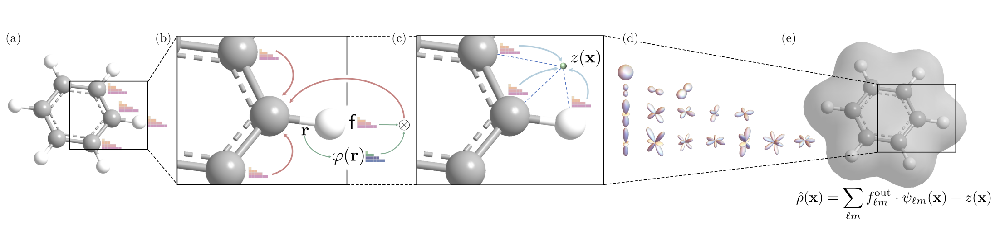

# InfGCN

[InfGCN: Equivariant Neural Operator Learning with Graphon Convolution](https://arxiv.org/abs/2311.10908)

## Abstract

We propose a general architecture that combines a coefficient-learning scheme with a residual operator layer for learning mappings between continuous functions in 3D Euclidean space. The model is SE(3)-equivariant by design. From a graph-spectrum view, the method can be interpreted as convolution on graphons (dense graphs with infinitely many nodes), which we term InfGCN. By leveraging both the continuous graphon structure and the discrete graph structure of the input data, the model effectively captures geometric information while preserving equivariance. On large-scale electron-density datasets, InfGCN outperforms current state-of-the-art architectures, and ablation studies confirm the effectiveness of the design.



---

## Model Description

### Overview
InfGCN is an operator-learning model for **electron density prediction**. Given atom types $Z = (z_1,\ldots,z_N)$ and Cartesian coordinates $R = (r_1,\ldots,r_N) \in \mathbb{R}^{N \times 3}$, the model predicts a continuous electron-density field $\rho(x)$ (typically evaluated on a 3D grid). The core idea is:
- **Atom-centered basis expansion** to represent $\rho(x)$
- **SE(3)-equivariant graphon convolution** to learn expansion coefficients
- Optional **residual operator layer** to refine global details

### Method

#### 1) Atom-centered basis expansion
(1) Atom-centered basis expansion

The density field is expanded as a sum of atom-centered basis functions:

$$
\hat{\rho}(x) = \sum_{i=1}^{N} \sum_{n=1}^{N_r} \sum_{l=0}^{l_{\max}} \sum_{m=-l}^{l}
c_{i,nlm},\phi_{nlm}(x - r_i)
$$

A common choice for $\phi_{nlm}$ is a separable radial-angular basis:

$$
\phi_{nlm}(r) = g_n(|r|),Y_{lm}!\left(\widehat{r}\right),
\qquad r = x - r_i
$$

where $g_n(\cdot)$ is a radial basis and $Y_{lm}$ are spherical harmonics. All learnable information is in the coefficients $c_{i,nlm}$.

#### 2) SE(3)-equivariant coefficient learning
Coefficients are updated with equivariant message passing:

$$
C_i^{(s)} = \sum_{j \in \mathcal{N}(i)} W_{ij}^{(s)} \odot C_j^{(s-1)}, \quad s = 1,\ldots,S
$$

Edge weights $W_{ij}^{(s)}$ depend on distance and angle features (radial basis on $\lVert r_{ij}\rVert$, spherical harmonics on $\widehat{r_{ij}}$, and an MLP). This yields rotation equivariance, permutation invariance, and physically meaningful local-to-global aggregation.

#### 3) Residual operator layer (optional)

A lightweight refinement adds a learnable correction on top of the base expansion:

$$
\hat{\rho}(x) = \hat{\rho}{\text{base}}(x) + \Delta \rho{\theta}(x)
$$

where $\Delta \rho_{\theta}$ is produced by an extra operator acting on intermediate features (for example, grid features or learned coefficients).

#### 4) Training objective and metrics

A standard regression objective minimizes an $L_2$ error over the 3D domain:

$$
\mathcal{L} = \mathbb{E}!\left[\left|\hat{\rho} - \rho\right|_2^2\right]
$$

The density is discretized on an $n \times n \times n$ grid; grid points can be subsampled for memory efficiency. A common metric is **Normalized Mean Absolute Error (NMAE)**:

$$
\mathrm{NMAE} =
\frac{\sum_{i=1}^{n^3}\left|\hat{\rho}(x_i) - \rho(x_i)\right|}
{\sum_{i=1}^{n^3}\left|\rho(x_i)\right|}
$$

---

## Dataset Description

### Recommended data fields
- `atomic_numbers`: length-$N$ atomic numbers
- `pos`: $N \times 3$ Cartesian coordinates (Angstroms)
- `density`: 3D array (voxel grid), for example $n \times n \times n$
- `grid_meta` (optional): origin, spacing, and box vectors to define $x_i$
- Optional tags: `mol_id`, `frame_id`, normalization/scaling factors

### Datasets
- **QM9_EC**: Electron densities stored as `*.CHGCAR.lz4` in `dataset_ES/data_qm9` (train 123,835 / val 50 / test 10,000). [Data](https://paddle-org.bj.bcebos.com/paddlematerials/datasets/QM9_ES/qm9_es.tar), [Atom dictionary](https://paddle-org.bj.bcebos.com/paddlematerials/datasets/QM9_ES/qm9.json), [Split file](https://paddle-org.bj.bcebos.com/paddlematerials/datasets/QM9_ES/qm9_data_split.json).
- **MP_EC (cubic)**: Materials Project-style crystals serialized as `.json.xz` under `dataset_ES/data_cubic` (train 14,421 / val 1,000 / test 1,000). [Data](https://paddle-org.bj.bcebos.com/paddlematerials/datasets/MP_ES/mp_es.tar), [Atom dictionary](https://paddle-org.bj.bcebos.com/paddlematerials/datasets/MP_ES/crystal.json), [Split file](https://paddle-org.bj.bcebos.com/paddlematerials/datasets/MP_ES/crystal_data_split.json).
- **OMol25_EC**: Organic molecule cubes expected under `/home/liuxuwei01/processed_output` (train 16 / val 2 / test 2). [Data](https://paddle-org.bj.bcebos.com/paddlematerials/datasets/OMol25_ES/MC_5k/omol25_mc_5k.tar), [Atom dictionary](https://paddle-org.bj.bcebos.com/paddlematerials/datasets/OMol25_ES/MC_5k/omol25.json), [Split file](https://paddle-org.bj.bcebos.com/paddlematerials/datasets/OMol25_ES/MC_5k/omol25_data_split.json).
- **MD17_EC**: Small molecules (for example, ethanol, benzene, phenol, resorcinol) from the MD17 electron-density release in `dataset_ES/data_md`; default config trains on ethanol. [Data](https://paddle-org.bj.bcebos.com/paddlematerials/datasets/MD17_ES/md17_es.tar.gz).

---

## Results

<table>
    <thead>
        <tr>
            <th nowrap="nowrap">Model Name</th>
            <th nowrap="nowrap">Dataset</th>
            <th nowrap="nowrap">Normalized MAE of Density</th>
            <th nowrap="nowrap">GPUs</th>
            <th nowrap="nowrap">Training time</th>
            <th nowrap="nowrap">Config</th>
            <th nowrap="nowrap">Checkpoint | Log</th>
        </tr>
    </thead>
    <tbody>
        <tr>
            <td nowrap="nowrap">infgcn_md17_benzene</td>
            <td nowrap="nowrap">MD17_EC_Benzene</td>
            <td nowrap="nowrap">21.2614%</td>
            <td nowrap="nowrap">1</td>
            <td nowrap="nowrap">59min</td>
            <td nowrap="nowrap"><a href="../../../electronic_structure/configs/infgcn/infgcn_md17_benzene.yaml">infgcn_md17_benzene</a></td>
            <td nowrap="nowrap"><a href="https://paddle-org.bj.bcebos.com/paddlematerials/checkpoints/electronic_structure/infgcn/infgcn_md17_benzene_t_20260104_083255_s_42.zip">checkpoint | log</td>
        </tr>
        <tr>
            <td nowrap="nowrap">infgcn_md17_ethane</td>
            <td nowrap="nowrap">MD17_EC_Ethane</td>
            <td nowrap="nowrap">6.9443%</td>
            <td nowrap="nowrap">1</td>
            <td nowrap="nowrap">1hour17min</td>
            <td nowrap="nowrap"><a href="../../../electronic_structure/configs/infgcn/infgcn_md17_ethane.yaml">infgcn_md17_ethane</a></td>
            <td nowrap="nowrap"><a href="https://paddle-org.bj.bcebos.com/paddlematerials/checkpoints/electronic_structure/infgcn/infgcn_md17_ethane_t_20260105_035402_s_42.zip">checkpoint | log</td>
        </tr>
        <tr>
            <td nowrap="nowrap">infgcn_md17_ethanol</td>
            <td nowrap="nowrap">MD17_EC_Ethanol</td>
            <td nowrap="nowrap">64.5951%</td>
            <td nowrap="nowrap">1</td>
            <td nowrap="nowrap">7min</td>
            <td nowrap="nowrap"><a href="../../../electronic_structure/configs/infgcn/infgcn_md17_ethanol.yaml">infgcn_md17_ethanol</a></td>
            <td nowrap="nowrap"><a href="https://paddle-org.bj.bcebos.com/paddlematerials/checkpoints/electronic_structure/infgcn/infgcn_md17_ethanol_t_20260105_051323_s_42.zip">checkpoint | log</td>
        </tr>
        <tr>
            <td nowrap="nowrap">infgcn_md17_malonaldehyde</td>
            <td nowrap="nowrap">MD17_EC_Malonaldehyde</td>
            <td nowrap="nowrap">17.7947%</td>
            <td nowrap="nowrap">1</td>
            <td nowrap="nowrap">1hour29min</td>
            <td nowrap="nowrap"><a href="../../../electronic_structure/configs/infgcn/infgcn_md17_malonaldehyde.yaml">infgcn_md17_malonaldehyde</a></td>
            <td nowrap="nowrap"><a href="https://paddle-org.bj.bcebos.com/paddlematerials/checkpoints/electronic_structure/infgcn/infgcn_md17_malonaldehyde_t_20260105_052204_s_42.zip">checkpoint | log</td>
        </tr>
        <tr>
            <td nowrap="nowrap">infgcn_md17_phenol</td>
            <td nowrap="nowrap">MD17_EC_Phenol</td>
            <td nowrap="nowrap">20.2144%</td>
            <td nowrap="nowrap">1</td>
            <td nowrap="nowrap">1hour17min</td>
            <td nowrap="nowrap"><a href="../../../electronic_structure/configs/infgcn/infgcn_md17_phenol.yaml">infgcn_md17_phenol</a></td>
            <td nowrap="nowrap"><a href="https://paddle-org.bj.bcebos.com/paddlematerials/checkpoints/electronic_structure/infgcn/infgcn_md17_phenol_t_20260107_041611_s_42.zip">checkpoint | log</td>
        </tr>
        <tr>
            <td nowrap="nowrap">infgcn_md17_resorcinol</td>
            <td nowrap="nowrap">MD17_EC_Resorcinol</td>
            <td nowrap="nowrap">15.8850%</td>
            <td nowrap="nowrap">1</td>
            <td nowrap="nowrap">1hour23min</td>
            <td nowrap="nowrap"><a href="../../../electronic_structure/configs/infgcn/infgcn_md17_resorcinol.yaml">infgcn_md17_resorcinol</a></td>
            <td nowrap="nowrap"><a href="https://paddle-org.bj.bcebos.com/paddlematerials/checkpoints/electronic_structure/infgcn/infgcn_md17_resorcinol_t_20260104_083255_s_42.zip">checkpoint | log</td>
        </tr>
        <tr>
            <td nowrap="nowrap">infgcn_qm9</td>
            <td nowrap="nowrap">QM9_EC</td>
            <td nowrap="nowrap">1.7542%</td>
            <td nowrap="nowrap">1</td>
            <td nowrap="nowrap">75hour41min</td>
            <td nowrap="nowrap"><a href="../../../electronic_structure/configs/infgcn/infgcn_qm9.yaml">infgcn_qm9</a></td>
            <td nowrap="nowrap"><a href="https://paddle-org.bj.bcebos.com/paddlematerials/checkpoints/electronic_structure/infgcn/infgcn_qm9_t_20260107_113954_s_42.zip">checkpoint | log</td>
        </tr>
        <tr>
            <td nowrap="nowrap">infgcn_cubic</td>
            <td nowrap="nowrap">MP_EC (cubic)</td>
            <td nowrap="nowrap">47.3829%</td>
            <td nowrap="nowrap">1</td>
            <td nowrap="nowrap">12hour6min</td>
            <td nowrap="nowrap"><a href="../../../electronic_structure/configs/infgcn/infgcn_cubic.yaml">infgcn_cubic</a></td>
            <td nowrap="nowrap"><a href="https://paddle-org.bj.bcebos.com/paddlematerials/checkpoints/electronic_structure/infgcn/infgcn_mp_t_20260108_024145_s_42.zip">checkpoint | log</td>
        </tr>
        <tr>
            <td nowrap="nowrap">infgcn_omol25</td>
            <td nowrap="nowrap">OMol25_EC</td>
            <td nowrap="nowrap">TBD</td>
            <td nowrap="nowrap">~</td>
            <td nowrap="nowrap">~</td>
            <td nowrap="nowrap"><a href="../../../electronic_structure/configs/infgcn/infgcn_omol25.yaml">infgcn_omol25</a></td>
            <td nowrap="nowrap">TBD</td>
        </tr>
    </tbody>
</table>

**Note**: Benchmarks are being regenerated in Paddle; metrics and downloadable checkpoints will be published once validation completes. Pretrained QM9 weights: [infgcn_qm9](https://paddle-org.bj.bcebos.com/paddlematerials/checkpoints/electronic_structure/infgcn/infgcn_qm9.pdparams)

---

## Command

### Training
```bash
# multi-gpu training (example with 4 GPUs)
python -m paddle.distributed.launch --gpus="0,1,2,3" electronic_structure/train.py -c electronic_structure/configs/infgcn/infgcn_qm9.yaml
# single-gpu training
python electronic_structure/train.py -c electronic_structure/configs/infgcn/infgcn_qm9.yaml
```

### Validation
```bash
# Enable eval-only mode with a saved checkpoint.
python electronic_structure/train.py -c electronic_structure/configs/infgcn/infgcn_qm9.yaml Global.do_eval=True Global.do_train=False Global.do_test=False Trainer.pretrained_model_path='path/to/model.pdparams'
```

### Testing
```bash
# Evaluate on the test split using a pretrained checkpoint.
python electronic_structure/train.py -c electronic_structure/configs/infgcn/infgcn_qm9.yaml Global.do_eval=False Global.do_train=False Global.do_test=True Trainer.pretrained_model_path='path/to/model.pdparams'
```

### Prediction
```bash
# Run inference with the standalone predictor (uses dataset paths from the YAML unless overridden).
python electronic_structure/predict.py \
  --config electronic_structure/configs/infgcn/infgcn_qm9.yaml \
  --checkpoint output/infgcn_qm9_best/infgcn_qm9.pdparams \
  --split validation \
  --index 0 \
  --grid_batch_size 20000 \
  --output_dir output/infgcn_qm9_best/vis_val0
# If your datasets live elsewhere, create a symlink to the data root (for example, ln -s /path/to/dataset_ES dataset_ES).
# If kaleido is missing, the script writes interactive .html files instead of .png; install kaleido to export PNGs.
```

---

## Citation
```
@article{cheng2023infgcn,
  title={Equivariant neural operator learning with graphon convolution},
  author={Cheng, Chaoran and Peng, Jian},
  journal={arXiv preprint arXiv:2311.10908},
  year={2023}
}
```
