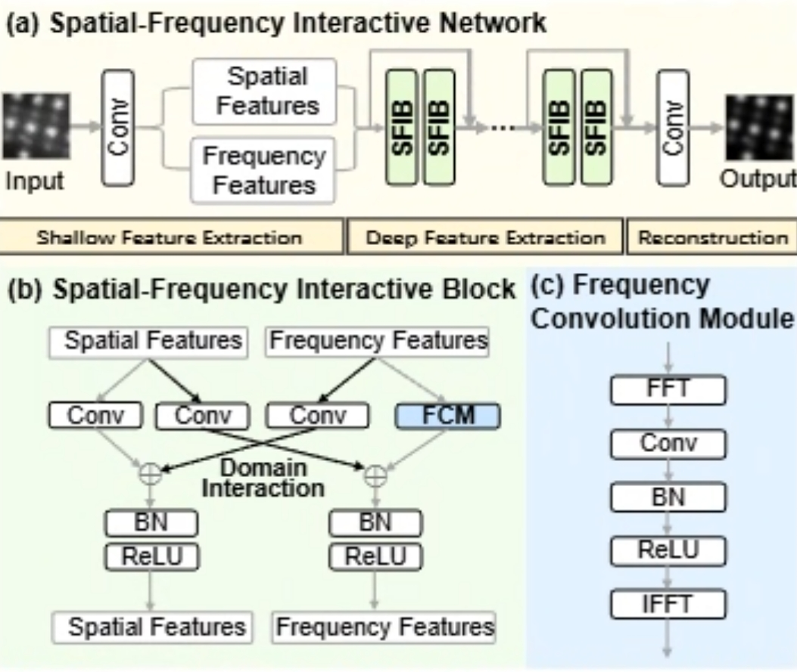

# SFIN

[Noise Calibration and Spatial-Frequency Interactive Network for STEM Image Enhancement](https://arxiv.org/pdf/2504.02555)

## Abstract

Scanning transmission electron microscopy (STEM) images often suffer from
severe noise and missing structural details under low-dose acquisition.
SFIN introduces a noise calibration and spatial-frequency interaction network
for paired STEM image restoration. PaddleMaterials provides four SFIN configs
covering HAADF and BF inputs, with `gt_enhance` and `gt_detect` as the two
supervised targets. `gt_enhance` is the image enhancement target, used to
recover a clean STEM image with improved contrast and structural details.
`gt_detect` is the detection-oriented target, used to highlight structural
features such as atom-column responses for downstream structure localization.

## Datasets

SFIN uses two paired STEM image datasets: HAADF and BF. Each dataset contains
`train` and `test` splits. A sample is one noisy grayscale input paired with
two labels, `gt_enhance` and `gt_detect`.

| Dataset | Train | Val/Test | Labels |
| :---: | :---: | :---: | :---: |
| [HAADF](https://paddle-org.bj.bcebos.com/paddlematerials/datasets/SFIN/sfin_haadf.zip) | 1000 | 100 | `gt_enhance`, `gt_detect` |
| [BF](https://paddle-org.bj.bcebos.com/paddlematerials/datasets/SFIN/sfin_bf.zip) | 1000 | 100 | `gt_enhance`, `gt_detect` |

## Model

<p align="center">
  
</p>

SFIN contains a noise calibration module and a spatial-frequency interaction
network. The noise calibration module estimates and suppresses low-dose
acquisition noise before restoration. The spatial-frequency interaction
network combines spatial-domain features, which preserve local morphology and
atom-column structures, with frequency-domain features, which capture global
periodic and contrast information. Their interaction helps recover fine
structural details while reducing noise and artifacts.

Training objective:

```math
\mathcal{L} = \left\| \hat{I} - I_{gt} \right\|_1
```

## Metric

Predictions and targets are evaluated with value range `[0, 255]`. For `N`
images with shape `C x H x W`, the global mean squared error is computed over
all pixels:

```math
\mathrm{MSE}_{global}
= \frac{1}{NCHW}
\sum_{n=1}^{N}\sum_{c=1}^{C}\sum_{h=1}^{H}\sum_{w=1}^{W}
\left(\hat{I}_{nchw} - I_{nchw}\right)^2
```

```math
\mathrm{PSNR}_{global}
= 10\log_{10}
\left(
\frac{L^2}{\max(\mathrm{MSE}_{global}, \epsilon)}
\right),
\quad L=255,\ \epsilon=10^{-12}
```

SSIM is computed on raw tensors using an `11 x 11` Gaussian window with
`sigma=1.5`:

```math
\mathrm{SSIM}(x,y)
=
\frac{(2\mu_x\mu_y + C_1)(2\sigma_{xy} + C_2)}
{(\mu_x^2 + \mu_y^2 + C_1)(\sigma_x^2 + \sigma_y^2 + C_2)}
```

where `C1=(0.01L)^2`, `C2=(0.03L)^2`, and `L=255`. The reported SSIM is the
mean value of the SSIM map over all evaluated images.

## Results

<table>
    <head>
        <tr>
            <th nowrap="nowrap">Model Name</th>
            <th nowrap="nowrap">Dataset</th>
            <th nowrap="nowrap">Target</th>
            <th nowrap="nowrap">PSNR / SSIM(Test dataset)</th>
            <th nowrap="nowrap">GPUs</th>
            <th nowrap="nowrap">Training time</th>
            <th nowrap="nowrap">Config</th>
            <th nowrap="nowrap">Checkpoint | Log</th>
        </tr>
    </head>
    <body>
        <tr>
            <td nowrap="nowrap">sfin_haadf_enhance</td>
            <td nowrap="nowrap">HAADF test</td>
            <td nowrap="nowrap">gt_enhance</td>
            <td nowrap="nowrap">37.440395 / 0.967452</td>
            <td nowrap="nowrap">1 (V100-32GB)</td>
            <td nowrap="nowrap">~21.5 hours</td>
            <td nowrap="nowrap"><a href="sfin_haadf_enhance.yaml">sfin_haadf_enhance</a></td>
            <td nowrap="nowrap"><a href="https://paddle-org.bj.bcebos.com/paddlematerials/checkpoints/spectrum_enhancement/sfin/sfin_haadf_enhance.zip">checkpoint</a></td>
        </tr>
        <tr>
            <td nowrap="nowrap">sfin_haadf_detect</td>
            <td nowrap="nowrap">HAADF test</td>
            <td nowrap="nowrap">gt_detect</td>
            <td nowrap="nowrap">26.013702 / 0.964492</td>
            <td nowrap="nowrap">1 (V100-32GB)</td>
            <td nowrap="nowrap">~21.2 hours</td>
            <td nowrap="nowrap"><a href="sfin_haadf_detect.yaml">sfin_haadf_detect</a></td>
            <td nowrap="nowrap"><a href="https://paddle-org.bj.bcebos.com/paddlematerials/checkpoints/spectrum_enhancement/sfin/sfin_haadf_detect.zip">checkpoint</a></td>
        </tr>
        <tr>
            <td nowrap="nowrap">sfin_bf_enhance</td>
            <td nowrap="nowrap">BF test</td>
            <td nowrap="nowrap">gt_enhance</td>
            <td nowrap="nowrap">31.339841 / 0.992708</td>
            <td nowrap="nowrap">1 (V100-32GB)</td>
            <td nowrap="nowrap">~19.1 hours</td>
            <td nowrap="nowrap"><a href="sfin_bf_enhance.yaml">sfin_bf_enhance</a></td>
            <td nowrap="nowrap"><a href="https://paddle-org.bj.bcebos.com/paddlematerials/checkpoints/spectrum_enhancement/sfin/sfin_bf_enhance.zip">checkpoint</a></td>
        </tr>
        <tr>
            <td nowrap="nowrap">sfin_bf_detect</td>
            <td nowrap="nowrap">BF test</td>
            <td nowrap="nowrap">gt_detect</td>
            <td nowrap="nowrap">23.826540 / 0.943309</td>
            <td nowrap="nowrap">1 (V100-32GB)</td>
            <td nowrap="nowrap">~21.3 hours</td>
            <td nowrap="nowrap"><a href="sfin_bf_detect.yaml">sfin_bf_detect</a></td>
            <td nowrap="nowrap"><a href="https://paddle-org.bj.bcebos.com/paddlematerials/checkpoints/spectrum_enhancement/sfin/sfin_bf_detect.zip">checkpoint</a></td>
        </tr>
    </body>
</table>

## Command

### Training

```bash
# HAADF enhance
python spectrum_enhancement/train.py \
  -c spectrum_enhancement/configs/sfin/sfin_haadf_enhance.yaml

# HAADF detect
python spectrum_enhancement/train.py \
  -c spectrum_enhancement/configs/sfin/sfin_haadf_detect.yaml

# BF enhance
python spectrum_enhancement/train.py \
  -c spectrum_enhancement/configs/sfin/sfin_bf_enhance.yaml

# BF detect
python spectrum_enhancement/train.py \
  -c spectrum_enhancement/configs/sfin/sfin_bf_detect.yaml
```

### Validation

```bash
# Use Global.do_eval=True and provide a checkpoint path.
python spectrum_enhancement/train.py \
  -c spectrum_enhancement/configs/sfin/sfin_haadf_enhance.yaml \
  Global.do_train=False \
  Global.do_eval=True \
  Global.do_test=False \
  Trainer.pretrained_model_path='path/to/model.pdparams'
```

### Testing

```bash
# Evaluate on the test dataset.
python spectrum_enhancement/train.py \
  -c spectrum_enhancement/configs/sfin/sfin_haadf_enhance.yaml \
  Global.do_train=False \
  Global.do_eval=False \
  Global.do_test=True \
  Trainer.pretrained_model_path='path/to/model.pdparams'
```

### Prediction

Pretrained prediction is available through registered model names:

```bash
# Mode 1: use registered pretrained weights with the bundled HAADF example.
python spectrum_enhancement/predict.py \
  --model_name sfin_haadf_enhance \
  --weights_name best.pdparams \
  --input_path spectrum_enhancement/example_data/sfin_haadf.png \
  --output_path ./output/sfin_haadf_predictions

# Use the bundled BF example with the matching BF model.
python spectrum_enhancement/predict.py \
  --model_name sfin_bf_enhance \
  --weights_name best.pdparams \
  --input_path spectrum_enhancement/example_data/sfin_bf.png \
  --output_path ./output/sfin_bf_predictions
```

Or override the checkpoint and data path explicitly:

```bash
# Mode 2: custom config + checkpoint + local noisy-image directory.
python spectrum_enhancement/predict.py \
  --config_path spectrum_enhancement/configs/sfin/sfin_bf_detect.yaml \
  --checkpoint_path https://paddle-org.bj.bcebos.com/paddlematerials/checkpoints/spectrum_enhancement/sfin/sfin_bf_detect.zip \
  --input_path ./sfin_bf/test/noisy \
  --output_path ./output/sfin_predictions
```

`--input_path` accepts either one noisy image or a directory containing noisy
images. Prediction does not require a dataset split or target images.

## References

- Reference implementation: [HeasonLee/SFIN](https://github.com/HeasonLee/SFIN)
- Paper: [Noise Calibration and Spatial-Frequency Interactive Network for STEM Image Enhancement](https://arxiv.org/pdf/2504.02555)

## Citation

```bibtex
@inproceedings{li2025sfin,
  title={Noise Calibration and Spatial-Frequency Interactive Network for STEM Image Enhancement},
  author={Li, Hesong and Wu, Ziqi and Shao, Ruiwen and Zhang, Tao and Fu, Ying},
  booktitle={Proceedings of the IEEE/CVF Conference on Computer Vision and Pattern Recognition (CVPR)},
  year={2025}
}
```
