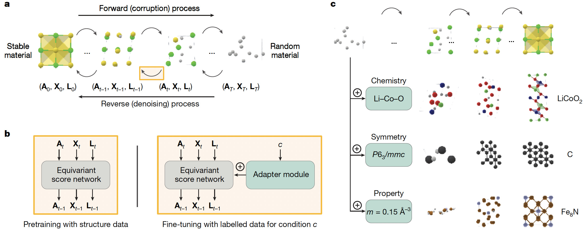

# MatterGen

[A generative model for inorganic materials design](https://www.nature.com/articles/s41586-025-08628-5)

## Abstract

The design of functional materials with desired properties is essential in driving technological advances in areas like energy storage, catalysis, and carbon capture. Generative models provide a new paradigm for materials design by directly generating novel materials given desired property constraints, but current methods have low success rates in proposing stable crystals or can only satisfy a limited set of property constraints. Here, we present MatterGen, a model that generates stable, diverse inorganic materials across the periodic table and can be fine-tuned to steer the generation toward a broad range of property constraints. Compared to prior generative models, structures produced by MatterGen are more than twice as likely to be novel and stable, and more than 10 times closer to the local energy minimum. After fine-tuning, MatterGen successfully generates stable, novel materials with desired chemistry, symmetry, as well as mechanical, electronic, and magnetic properties. As a proof of concept, we synthesize one of the generated structures and measure its property value to be within 20% of our target. We believe that the quality of generated materials and the breadth of MatterGen's capabilities represent a major advancement toward creating a foundational generative model for materials design.



---

## Model Description

### Overview
MatterGen is a diffusion-based generative model for **periodic inorganic crystal structures**. A crystal is represented by its unit cell:
- atom types: $A = (a_1,\ldots,a_N)$
- fractional coordinates: $X = (x_1,\ldots,x_N),\; x_i \in [0,1)^3$
- lattice: $L \in \mathbb{R}^{3 \times 3}$

MatterGen defines separate forward corruption processes for $(A, X, L)$ and trains an equivariant score network to reverse (denoise) them. The model can be further adapted to conditional generation (chemistry / symmetry / scalar properties) via lightweight adapter modules and classifier-free guidance.

### Method

#### 1) Forward diffusion (corruption)

##### (a) Fractional coordinate diffusion on a torus (periodic boundary)
Because fractional coordinates live on a 3D torus, MatterGen uses a **wrapped Normal** corruption that approaches the **uniform distribution** as noise increases.

$$
p_t(x_t \mid x_0) \propto \sum_{k \in \mathbb{Z}^3}
\exp\left(-\frac{\|x_t - x_0 + k\|^2}{2\sigma^2(t)}\right),
\qquad x_t, x_0 \in [0,1)^3
$$

In practice, we can sample by adding Gaussian noise and wrapping back into the unit cell:

$$
\tilde{x}_t = x_0 + \sigma(t)\,\epsilon,\qquad \epsilon \sim \mathcal{N}(0, I)
$$

$$
x_t = \tilde{x}_t \bmod 1
$$

##### (b) Lattice diffusion
The lattice diffusion is defined on the periodic lattice matrix $L$ with a noise schedule such that the noisy limit approaches a physically motivated lattice distribution (for example, centered around a cubic lattice with the average density from training data). In implementation, this is commonly handled by diffusing a suitable lattice parameterization and training the network to denoise it.

$$
L_t = \sqrt{\alpha(t)}\,L_0 + \sqrt{1 - \alpha(t)}\,\epsilon
$$

##### (c) Atom-type diffusion in categorical space
Atom types are diffused as a **discrete corruption** process (for example, masking atoms into a special $\text{[MASK]}$ state with a time-dependent probability). This allows the model to gradually refine chemistry while remaining compatible with variable compositions.

$$
q(a_t \mid a_{t - \Delta t}) = (1 - \beta(t))\,\mathbb{I}[a_t = a_{t - \Delta t}] + \beta(t)\,\mathbb{I}[a_t = \text{[MASK]}]
$$

#### 2) Equivariant score network (denoiser)
MatterGen uses an E(3)-equivariant graph neural network (GNN) to predict:
- **invariant** logits/scores for atom types $A$
- **equivariant** scores (or noise) for coordinates $X$
- **equivariant** scores (or noise) for lattice $L$

The key requirements are rotation/translation equivariance for geometric outputs (coordinates/lattice), permutation invariance over atoms, and periodic consistency via fractional coordinates plus lattice.

#### 3) Training objective (typical form)
A standard diffusion training objective combines continuous denoising losses and discrete cross-entropy losses:

$$
\begin{aligned}
\mathcal{L}
&= \lambda_X\,\mathbb{E}\big[\|\epsilon_X - \epsilon_{X,\theta}(X_t, A_t, L_t, t)\|_2^2\big] \\
&\quad + \lambda_L\,\mathbb{E}\big[\|\epsilon_L - \epsilon_{L,\theta}(X_t, A_t, L_t, t)\|_2^2\big] \\
&\quad + \lambda_A\,\mathbb{E}\big[-\log p_{\theta}(A_0 \mid A_t, X_t, L_t, t)\big]
\end{aligned}
$$

where $\epsilon_X, \epsilon_L$ are the injected noises for coordinates and lattice, and $p_\theta$ is the predicted atom-type distribution.

#### 4) Conditional generation (fine-tuning) and classifier-free guidance
To steer generation toward constraints (composition / symmetry / scalar properties), MatterGen introduces **adapter modules** injected into the base network and fine-tunes them on a labeled dataset. At sampling time, classifier-free guidance (CFG) can be used:

$$
s_{\mathrm{cfg}} = (1 + w)\,s_{\theta}(\cdot \mid c) - w\,s_{\theta}(\cdot \mid \varnothing)
$$

where $c$ is the condition (for example, a target property) and $w$ is the guidance scale.

---

## Dataset Description

### Dataset contents

#### 1) MP-20 (commonly used benchmark subset)
MP-20 typically refers to a benchmark subset of Materials Project structures with **up to 20 atoms per cell**, used in many crystal generative model papers. It is frequently adopted for fair comparison and for training smaller baseline models.

#### 2) Alex-MP-20 (large-scale pretraining dataset in MatterGen)
MatterGen pretrains on **Alex-MP-20**, a curated dataset that contains **607,683 stable structures (<= 20 atoms)** recomputed from Materials Project and Alexandria. Stability is defined using **energy-above-hull** after DFT relaxation (for example, <= 0.1 eV/atom with respect to a reference convex hull). A larger reference set (Alex-MP-ICSD) is used to define stability/novelty and to compute convex-hull statistics.

#### 3) Labeled datasets for fine-tuning (optional)
For conditional generation, a labeled dataset is needed. Each sample contains $(A, X, L)$ plus a condition label $c$ such as:
- scalar property targets (for example, band gap, bulk modulus, magnetic density)
- chemistry constraints (allowed elements / target system)
- symmetry constraints (for example, target space group)

### Data format (recommended)
Each structure sample should minimally provide:
- `atom_types`: length-$N$ list of atomic numbers or element indices
- `frac_coords`: $N \times 3$ fractional coordinates in $[0,1)$
- `lattice`: $3 \times 3$ lattice matrix (row/column convention must match the dataloader)

Optional fields include `num_atoms`, `spacegroup`, and `property` / `condition`.

---

## Results

| Model Name | Dataset | Val (loss) | Config | Checkpoint / Log |
| --- | --- | --- | --- | --- |
| mattergen_mp20 | mp20 | 0.3721 | [mattergen_mp20.yaml](mattergen_mp20.yaml) | [checkpoint / log](https://paddle-org.bj.bcebos.com/paddlematerial/checkpoints/structure_generation/mattergen/mattergen_mp20.zip) |
| mattergen_mp20_chemical_system | mp20 | 0.3121 | [mattergen_mp20_chemical_system.yaml](mattergen_mp20_chemical_system.yaml) | [checkpoint / log](https://paddle-org.bj.bcebos.com/paddlematerial/checkpoints/structure_generation/mattergen/mattergen_mp20_chemical_system.zip) |
| mattergen_mp20_dft_band_gap | mp20 | 0.3575 | [mattergen_mp20_dft_band_gap.yaml](mattergen_mp20_dft_band_gap.yaml) | [checkpoint / log](https://paddle-org.bj.bcebos.com/paddlematerial/checkpoints/structure_generation/mattergen/mattergen_mp20_dft_band_gap.zip) |
| mattergen_mp20_dft_bulk_modulus | mp20 | 0.2942 | [mattergen_mp20_dft_bulk_modulus.yaml](mattergen_mp20_dft_bulk_modulus.yaml) | [checkpoint / log](https://paddle-org.bj.bcebos.com/paddlematerial/checkpoints/structure_generation/mattergen/mattergen_mp20_dft_bulk_modulus.zip) |
| mattergen_mp20_dft_mag_density | mp20 | 0.3620 | [mattergen_mp20_dft_mag_density.yaml](mattergen_mp20_dft_mag_density.yaml) | [checkpoint / log](https://paddle-org.bj.bcebos.com/paddlematerial/checkpoints/structure_generation/mattergen/mattergen_mp20_dft_mag_density.zip) |
| mattergen_alex_mp20 | alex_mp20 | 0.2960 | [mattergen_alex_mp20.yaml](mattergen_alex_mp20.yaml) | [checkpoint / log](https://paddle-org.bj.bcebos.com/paddlematerial/checkpoints/structure_generation/mattergen/mattergen_alex_mp20.zip) |
| mattergen_alex_mp20_dft_band_gap | alex_mp20 | 0.3101 | [mattergen_alex_mp20_dft_band_gap.yaml](mattergen_alex_mp20_dft_band_gap.yaml) | [checkpoint / log](https://paddle-org.bj.bcebos.com/paddlematerial/checkpoints/structure_generation/mattergen/mattergen_alex_mp20_dft_band_gap.zip) |
| mattergen_alex_mp20_chemical_system | alex_mp20 | 0.2289 | [mattergen_alex_mp20_chemical_system.yaml](mattergen_alex_mp20_chemical_system.yaml) | [checkpoint / log](https://paddle-org.bj.bcebos.com/paddlematerial/checkpoints/structure_generation/mattergen/mattergen_alex_mp20_chemical_system.zip) |
| mattergen_alex_mp20_dft_mag_density | alex_mp20 | 0.2881 | [mattergen_alex_mp20_dft_mag_density.yaml](mattergen_alex_mp20_dft_mag_density.yaml) | [checkpoint / log](https://paddle-org.bj.bcebos.com/paddlematerial/checkpoints/structure_generation/mattergen/mattergen_alex_mp20_dft_mag_density.zip) |
| mattergen_alex_mp20_ml_bulk_modulus | alex_mp20 | 0.2811 | [mattergen_alex_mp20_ml_bulk_modulus.yaml](mattergen_alex_mp20_ml_bulk_modulus.yaml) | [checkpoint / log](https://paddle-org.bj.bcebos.com/paddlematerial/checkpoints/structure_generation/mattergen/mattergen_alex_mp20_ml_bulk_modulus.zip) |
| mattergen_alex_mp20_space_group | alex_mp20 | 0.2795 | [mattergen_alex_mp20_space_group.yaml](mattergen_alex_mp20_space_group.yaml) | [checkpoint / log](https://paddle-org.bj.bcebos.com/paddlematerial/checkpoints/structure_generation/mattergen/mattergen_alex_mp20_space_group.zip) |
| mattergen_alex_mp20_chemical_system_energy_above_hull | alex_mp20 | 0.2272 | [mattergen_alex_mp20_chemical_system_energy_above_hull.yaml](mattergen_alex_mp20_chemical_system_energy_above_hull.yaml) | [checkpoint / log](https://paddle-org.bj.bcebos.com/paddlematerial/checkpoints/structure_generation/mattergen/mattergen_alex_mp20_chemical_system_energy_above_hull.zip) |
| mattergen_alex_mp20_dft_mag_density_hhi_score | alex_mp20 | 0.2803 | [mattergen_alex_mp20_dft_mag_density_hhi_score.yaml](mattergen_alex_mp20_dft_mag_density_hhi_score.yaml) | [checkpoint / log](https://paddle-org.bj.bcebos.com/paddlematerial/checkpoints/structure_generation/mattergen/mattergen_alex_mp20_dft_mag_density_hhi_score.zip) |

---

## Command

### Training
```bash
# mp20 dataset, without conditional constraints
# multi-gpu training (example with 8 GPUs)
python -m paddle.distributed.launch --gpus="0,1,2,3,4,5,6,7" structure_generation/train.py -c structure_generation/configs/mattergen/mattergen_mp20.yaml
# single-gpu training
python structure_generation/train.py -c structure_generation/configs/mattergen/mattergen_mp20.yaml

# mp20 dataset, with chemical system constraints (pre-trained model is mattergen_mp20; downloads automatically)
# multi-gpu training (example with 8 GPUs)
python -m paddle.distributed.launch --gpus="0,1,2,3,4,5,6,7" structure_generation/train.py -c structure_generation/configs/mattergen/mattergen_mp20_chemical_system.yaml
# single-gpu training
python structure_generation/train.py -c structure_generation/configs/mattergen/mattergen_mp20_chemical_system.yaml

# mp20 dataset, with dft_band_gap constraints (pre-trained model is mattergen_mp20; downloads automatically)
# multi-gpu training (example with 8 GPUs)
python -m paddle.distributed.launch --gpus="0,1,2,3,4,5,6,7" structure_generation/train.py -c structure_generation/configs/mattergen/mattergen_mp20_dft_band_gap.yaml
# single-gpu training
python structure_generation/train.py -c structure_generation/configs/mattergen/mattergen_mp20_dft_band_gap.yaml

# mp20 dataset, with dft_bulk_modulus constraints (pre-trained model is mattergen_mp20; downloads automatically)
# multi-gpu training (example with 8 GPUs)
python -m paddle.distributed.launch --gpus="0,1,2,3,4,5,6,7" structure_generation/train.py -c structure_generation/configs/mattergen/mattergen_mp20_dft_bulk_modulus.yaml
# single-gpu training
python structure_generation/train.py -c structure_generation/configs/mattergen/mattergen_mp20_dft_bulk_modulus.yaml

# mp20 dataset, with dft_mag_density constraints (pre-trained model is mattergen_mp20; downloads automatically)
# multi-gpu training (example with 8 GPUs)
python -m paddle.distributed.launch --gpus="0,1,2,3,4,5,6,7" structure_generation/train.py -c structure_generation/configs/mattergen/mattergen_mp20_dft_mag_density.yaml
# single-gpu training
python structure_generation/train.py -c structure_generation/configs/mattergen/mattergen_mp20_dft_mag_density.yaml

# alex_mp20 dataset, without conditional constraints
# multi-gpu training (example with 8 GPUs)
python -m paddle.distributed.launch --gpus="0,1,2,3,4,5,6,7" structure_generation/train.py -c structure_generation/configs/mattergen/mattergen_alex_mp20.yaml
# single-gpu training
python structure_generation/train.py -c structure_generation/configs/mattergen/mattergen_alex_mp20.yaml

# alex_mp20 dataset, with dft_band_gap constraints (pre-trained model is mattergen_alex_mp20; downloads automatically)
# multi-gpu training (example with 8 GPUs)
python -m paddle.distributed.launch --gpus="0,1,2,3,4,5,6,7" structure_generation/train.py -c structure_generation/configs/mattergen/mattergen_alex_mp20_dft_band_gap.yaml
# single-gpu training
python structure_generation/train.py -c structure_generation/configs/mattergen/mattergen_alex_mp20_dft_band_gap.yaml

# alex_mp20 dataset, with chemical system constraints (pre-trained model is mattergen_alex_mp20; downloads automatically)
# multi-gpu training (example with 8 GPUs)
python -m paddle.distributed.launch --gpus="0,1,2,3,4,5,6,7" structure_generation/train.py -c structure_generation/configs/mattergen/mattergen_alex_mp20_chemical_system.yaml
# single-gpu training
python structure_generation/train.py -c structure_generation/configs/mattergen/mattergen_alex_mp20_chemical_system.yaml

# alex_mp20 dataset, with dft_mag_density constraints (pre-trained model is mattergen_alex_mp20; downloads automatically)
# multi-gpu training (example with 8 GPUs)
python -m paddle.distributed.launch --gpus="0,1,2,3,4,5,6,7" structure_generation/train.py -c structure_generation/configs/mattergen/mattergen_alex_mp20_dft_mag_density.yaml
# single-gpu training
python structure_generation/train.py -c structure_generation/configs/mattergen/mattergen_alex_mp20_dft_mag_density.yaml

# alex_mp20 dataset, with ml_bulk_modulus constraints (pre-trained model is mattergen_alex_mp20; downloads automatically)
# multi-gpu training (example with 8 GPUs)
python -m paddle.distributed.launch --gpus="0,1,2,3,4,5,6,7" structure_generation/train.py -c structure_generation/configs/mattergen/mattergen_alex_mp20_ml_bulk_modulus.yaml
# single-gpu training
python structure_generation/train.py -c structure_generation/configs/mattergen/mattergen_alex_mp20_ml_bulk_modulus.yaml

# alex_mp20 dataset, with space_group constraints (pre-trained model is mattergen_alex_mp20; downloads automatically)
# multi-gpu training (example with 8 GPUs)
python -m paddle.distributed.launch --gpus="0,1,2,3,4,5,6,7" structure_generation/train.py -c structure_generation/configs/mattergen/mattergen_alex_mp20_space_group.yaml
# single-gpu training
python structure_generation/train.py -c structure_generation/configs/mattergen/mattergen_alex_mp20_space_group.yaml

# alex_mp20 dataset, with chemical system and energy above hull constraints (pre-trained model is mattergen_alex_mp20; downloads automatically)
# multi-gpu training (example with 8 GPUs)
python -m paddle.distributed.launch --gpus="0,1,2,3,4,5,6,7" structure_generation/train.py -c structure_generation/configs/mattergen/mattergen_alex_mp20_chemical_system_energy_above_hull.yaml
# single-gpu training
python structure_generation/train.py -c structure_generation/configs/mattergen/mattergen_alex_mp20_chemical_system_energy_above_hull.yaml

# alex_mp20 dataset, with dft_mag_density and hhi_score constraints (pre-trained model is mattergen_alex_mp20; downloads automatically)
# multi-gpu training (example with 8 GPUs)
python -m paddle.distributed.launch --gpus="0,1,2,3,4,5,6,7" structure_generation/train.py -c structure_generation/configs/mattergen/mattergen_alex_mp20_dft_mag_density_hhi_score.yaml
# single-gpu training
python structure_generation/train.py -c structure_generation/configs/mattergen/mattergen_alex_mp20_dft_mag_density_hhi_score.yaml
```

### Validation
```bash
# Adjust program behavior on the fly using command-line parameters without modifying the configuration file directly.
# Example: --Global.do_eval=True

# mp20 dataset, without conditional constraints
python structure_generation/train.py -c structure_generation/configs/mattergen/mattergen_mp20.yaml Global.do_eval=True Global.do_train=False Global.do_test=False Trainer.pretrained_model_path='path/to/model.pdparams'

# mp20 dataset, with chemical system constraints
python structure_generation/train.py -c structure_generation/configs/mattergen/mattergen_mp20_chemical_system.yaml Global.do_eval=True Global.do_train=False Global.do_test=False Trainer.pretrained_model_path='path/to/model.pdparams'

# mp20 dataset, with dft_band_gap constraints
python structure_generation/train.py -c structure_generation/configs/mattergen/mattergen_mp20_dft_band_gap.yaml Global.do_eval=True Global.do_train=False Global.do_test=False Trainer.pretrained_model_path='path/to/model.pdparams'

# mp20 dataset, with dft_bulk_modulus constraints
python structure_generation/train.py -c structure_generation/configs/mattergen/mattergen_mp20_dft_bulk_modulus.yaml Global.do_eval=True Global.do_train=False Global.do_test=False Trainer.pretrained_model_path='path/to/model.pdparams'

# mp20 dataset, with dft_mag_density constraints
python structure_generation/train.py -c structure_generation/configs/mattergen/mattergen_mp20_dft_mag_density.yaml Global.do_eval=True Global.do_train=False Global.do_test=False Trainer.pretrained_model_path='path/to/model.pdparams'

# alex_mp20 dataset, without conditional constraints
python structure_generation/train.py -c structure_generation/configs/mattergen/mattergen_alex_mp20.yaml Global.do_eval=True Global.do_train=False Global.do_test=False Trainer.pretrained_model_path='path/to/model.pdparams'

# alex_mp20 dataset, with dft_band_gap constraints
python structure_generation/train.py -c structure_generation/configs/mattergen/mattergen_alex_mp20_dft_band_gap.yaml Global.do_eval=True Global.do_train=False Global.do_test=False Trainer.pretrained_model_path='path/to/model.pdparams'

# alex_mp20 dataset, with chemical system constraints
python structure_generation/train.py -c structure_generation/configs/mattergen/mattergen_alex_mp20_chemical_system.yaml Global.do_eval=True Global.do_train=False Global.do_test=False Trainer.pretrained_model_path='path/to/model.pdparams'

# alex_mp20 dataset, with dft_mag_density constraints
python structure_generation/train.py -c structure_generation/configs/mattergen/mattergen_alex_mp20_dft_mag_density.yaml Global.do_eval=True Global.do_train=False Global.do_test=False Trainer.pretrained_model_path='path/to/model.pdparams'

# alex_mp20 dataset, with ml_bulk_modulus constraints
python structure_generation/train.py -c structure_generation/configs/mattergen/mattergen_alex_mp20_ml_bulk_modulus.yaml Global.do_eval=True Global.do_train=False Global.do_test=False Trainer.pretrained_model_path='path/to/model.pdparams'

# alex_mp20 dataset, with space_group constraints
python structure_generation/train.py -c structure_generation/configs/mattergen/mattergen_alex_mp20_space_group.yaml Global.do_eval=True Global.do_train=False Global.do_test=False Trainer.pretrained_model_path='path/to/model.pdparams'

# alex_mp20 dataset, with chemical system and energy above hull constraints
python structure_generation/train.py -c structure_generation/configs/mattergen/mattergen_alex_mp20_chemical_system_energy_above_hull.yaml Global.do_eval=True Global.do_train=False Global.do_test=False Trainer.pretrained_model_path='path/to/model.pdparams'

# alex_mp20 dataset, with dft_mag_density and hhi_score constraints
python structure_generation/train.py -c structure_generation/configs/mattergen/mattergen_alex_mp20_dft_mag_density_hhi_score.yaml Global.do_eval=True Global.do_train=False Global.do_test=False Trainer.pretrained_model_path='path/to/model.pdparams'
```

### Testing
```bash
# This command is used to evaluate the model's performance on the test dataset.

# mp20 dataset, without conditional constraints
python structure_generation/train.py -c structure_generation/configs/mattergen/mattergen_mp20.yaml Global.do_eval=False Global.do_train=False Global.do_test=True Trainer.pretrained_model_path='path/to/model.pdparams'

# mp20 dataset, with chemical system constraints
python structure_generation/train.py -c structure_generation/configs/mattergen/mattergen_mp20_chemical_system.yaml Global.do_eval=False Global.do_train=False Global.do_test=True Trainer.pretrained_model_path='path/to/model.pdparams'

# mp20 dataset, with dft_band_gap constraints
python structure_generation/train.py -c structure_generation/configs/mattergen/mattergen_mp20_dft_band_gap.yaml Global.do_eval=False Global.do_train=False Global.do_test=True Trainer.pretrained_model_path='path/to/model.pdparams'

# mp20 dataset, with dft_bulk_modulus constraints
python structure_generation/train.py -c structure_generation/configs/mattergen/mattergen_mp20_dft_bulk_modulus.yaml Global.do_eval=False Global.do_train=False Global.do_test=True Trainer.pretrained_model_path='path/to/model.pdparams'

# mp20 dataset, with dft_mag_density constraints
python structure_generation/train.py -c structure_generation/configs/mattergen/mattergen_mp20_dft_mag_density.yaml Global.do_eval=False Global.do_train=False Global.do_test=True Trainer.pretrained_model_path='path/to/model.pdparams'

# Since the alex_mp20 dataset does not include a test set, we cannot utilize the test command.
```

### Sample
```bash
# This command is used to predict the crystal structure using a trained model.
# Mode 1: Use a pre-trained model (downloads automatically).
# Mode 2: Use a custom configuration file and checkpoint.
# Results are saved to the folder specified by --output_dir (default: results).

# mp20 dataset, without conditional constraints
python structure_generation/sample.py --model_name='mattergen_mp20' --weights_name='latest.pdparams' --output_dir='result_mattergen_mp20/' --mode='by_num_atoms' --num_atoms=4
python structure_generation/sample.py --model_name='mattergen_mp20' --weights_name='latest.pdparams' --output_dir='result_mattergen_mp20/' --mode='by_dataloader'
python structure_generation/sample.py --config_path='structure_generation/configs/mattergen/mattergen_mp20.yaml' --checkpoint_path='./output/mattergen_mp20/checkpoints/latest.pdparams' --output_dir='result_mattergen_mp20/' --mode='by_num_atoms' --num_atoms=4
python structure_generation/sample.py --config_path='structure_generation/configs/mattergen/mattergen_mp20.yaml' --checkpoint_path='./output/mattergen_mp20/checkpoints/latest.pdparams' --output_dir='result_mattergen_mp20/' --mode='by_dataloader'

# mp20 dataset, with chemical system constraints
python structure_generation/sample.py --model_name='mattergen_mp20_chemical_system' --weights_name='latest.pdparams' --output_dir='result_mattergen_mp20_chemical_system/' --mode='by_dataloader'
python structure_generation/sample.py --config_path='structure_generation/configs/mattergen/mattergen_mp20_chemical_system.yaml' --checkpoint_path='./output/mattergen_mp20_chemical_system/checkpoints/latest.pdparams' --output_dir='result_mattergen_mp20_chemical_system/' --mode='by_dataloader'

# mp20 dataset, with dft_band_gap constraints
python structure_generation/sample.py --model_name='mattergen_mp20_dft_band_gap' --weights_name='latest.pdparams' --output_dir='result_mattergen_mp20_dft_band_gap/' --mode='by_dataloader'
python structure_generation/sample.py --config_path='structure_generation/configs/mattergen/mattergen_mp20_dft_band_gap.yaml' --checkpoint_path='./output/mattergen_mp20_dft_band_gap/checkpoints/latest.pdparams' --output_dir='result_mattergen_mp20_dft_band_gap/' --mode='by_dataloader'

# mp20 dataset, with dft_bulk_modulus constraints
python structure_generation/sample.py --model_name='mattergen_mp20_dft_bulk_modulus' --weights_name='latest.pdparams' --output_dir='result_mattergen_mp20_dft_bulk_modulus/' --mode='by_dataloader'
python structure_generation/sample.py --config_path='structure_generation/configs/mattergen/mattergen_mp20_dft_bulk_modulus.yaml' --checkpoint_path='./output/mattergen_mp20_dft_bulk_modulus/checkpoints/latest.pdparams' --output_dir='result_mattergen_mp20_dft_bulk_modulus/' --mode='by_dataloader'

# mp20 dataset, with dft_mag_density constraints
python structure_generation/sample.py --model_name='mattergen_mp20_dft_mag_density' --weights_name='latest.pdparams' --output_dir='result_mattergen_mp20_dft_mag_density/' --mode='by_dataloader'
python structure_generation/sample.py --config_path='structure_generation/configs/mattergen/mattergen_mp20_dft_mag_density.yaml' --checkpoint_path='./output/mattergen_mp20_dft_mag_density/checkpoints/latest.pdparams' --output_dir='result_mattergen_mp20_dft_mag_density/' --mode='by_dataloader'

# alex_mp20 dataset, without conditional constraints
python structure_generation/sample.py --model_name='mattergen_alex_mp20' --weights_name='latest.pdparams' --output_dir='result_mattergen_alex_mp20/' --mode='by_dataloader'
python structure_generation/sample.py --config_path='structure_generation/configs/mattergen/mattergen_alex_mp20.yaml' --checkpoint_path='./output/mattergen_alex_mp20/checkpoints/latest.pdparams' --output_dir='result_mattergen_alex_mp20/' --mode='by_dataloader'

# alex_mp20 dataset, with dft_band_gap constraints
python structure_generation/sample.py --model_name='mattergen_alex_mp20_dft_band_gap' --weights_name='latest.pdparams' --output_dir='result_mattergen_alex_mp20_dft_band_gap/' --mode='by_dataloader'
python structure_generation/sample.py --config_path='structure_generation/configs/mattergen/mattergen_alex_mp20_dft_band_gap.yaml' --checkpoint_path='./output/mattergen_alex_mp20_dft_band_gap/checkpoints/latest.pdparams' --output_dir='result_mattergen_alex_mp20_dft_band_gap/' --mode='by_dataloader'

# alex_mp20 dataset, with chemical system constraints
python structure_generation/sample.py --model_name='mattergen_alex_mp20_chemical_system' --weights_name='latest.pdparams' --output_dir='result_mattergen_alex_mp20_chemical_system/' --mode='by_dataloader'
python structure_generation/sample.py --config_path='structure_generation/configs/mattergen/mattergen_alex_mp20_chemical_system.yaml' --checkpoint_path='./output/mattergen_alex_mp20_chemical_system/checkpoints/latest.pdparams' --output_dir='result_mattergen_alex_mp20_chemical_system/' --mode='by_dataloader'

# alex_mp20 dataset, with dft_mag_density constraints
python structure_generation/sample.py --model_name='mattergen_alex_mp20_dft_mag_density' --weights_name='latest.pdparams' --output_dir='result_mattergen_alex_mp20_dft_mag_density/' --mode='by_dataloader'
python structure_generation/sample.py --config_path='structure_generation/configs/mattergen/mattergen_alex_mp20_dft_mag_density.yaml' --checkpoint_path='./output/mattergen_alex_mp20_dft_mag_density/checkpoints/latest.pdparams' --output_dir='result_mattergen_alex_mp20_dft_mag_density/' --mode='by_dataloader'

# alex_mp20 dataset, with ml_bulk_modulus constraints
python structure_generation/sample.py --model_name='mattergen_alex_mp20_ml_bulk_modulus' --weights_name='latest.pdparams' --output_dir='result_mattergen_alex_mp20_ml_bulk_modulus/' --mode='by_dataloader'
python structure_generation/sample.py --config_path='structure_generation/configs/mattergen/mattergen_alex_mp20_ml_bulk_modulus.yaml' --checkpoint_path='./output/mattergen_alex_mp20_ml_bulk_modulus/checkpoints/latest.pdparams' --output_dir='result_mattergen_alex_mp20_ml_bulk_modulus/' --mode='by_dataloader'

# alex_mp20 dataset, with space_group constraints
python structure_generation/sample.py --model_name='mattergen_alex_mp20_space_group' --weights_name='latest.pdparams' --output_dir='result_mattergen_alex_mp20_space_group/' --mode='by_dataloader'
python structure_generation/sample.py --config_path='structure_generation/configs/mattergen/mattergen_alex_mp20_space_group.yaml' --checkpoint_path='./output/mattergen_alex_mp20_space_group/checkpoints/latest.pdparams' --output_dir='result_mattergen_alex_mp20_space_group/' --mode='by_dataloader'

# alex_mp20 dataset, with chemical system and energy above hull constraints
python structure_generation/sample.py --model_name='mattergen_alex_mp20_chemical_system_energy_above_hull' --weights_name='latest.pdparams' --output_dir='result_mattergen_alex_mp20_chemical_system_energy_above_hull/' --mode='by_dataloader'
python structure_generation/sample.py --config_path='structure_generation/configs/mattergen/mattergen_alex_mp20_chemical_system_energy_above_hull.yaml' --checkpoint_path='./output/mattergen_alex_mp20_chemical_system_energy_above_hull/checkpoints/latest.pdparams' --output_dir='result_mattergen_alex_mp20_chemical_system_energy_above_hull/' --mode='by_dataloader'

# alex_mp20 dataset, with dft_mag_density and hhi_score constraints
python structure_generation/sample.py --model_name='mattergen_alex_mp20_dft_mag_density_hhi_score' --weights_name='latest.pdparams' --output_dir='result_mattergen_alex_mp20_dft_mag_density_hhi_score/' --mode='by_dataloader'
python structure_generation/sample.py --config_path='structure_generation/configs/mattergen/mattergen_alex_mp20_dft_mag_density_hhi_score.yaml' --checkpoint_path='./output/mattergen_alex_mp20_dft_mag_density_hhi_score/checkpoints/latest.pdparams' --output_dir='result_mattergen_alex_mp20_dft_mag_density_hhi_score/' --mode='by_dataloader'
```

---

## Citation
```
@article{zeni2025generative,
  title={A generative model for inorganic materials design},
  author={Zeni, Claudio and Pinsler, Robert and Z{\"u}gner, Daniel and Fowler, Andrew and Horton, Matthew and Fu, Xiang and Wang, Zilong and Shysheya, Aliaksandra and Crabb{\'e}, Jonathan and Ueda, Shoko and others},
  journal={Nature},
  pages={1--3},
  year={2025},
  publisher={Nature Publishing Group UK London}
}
```
